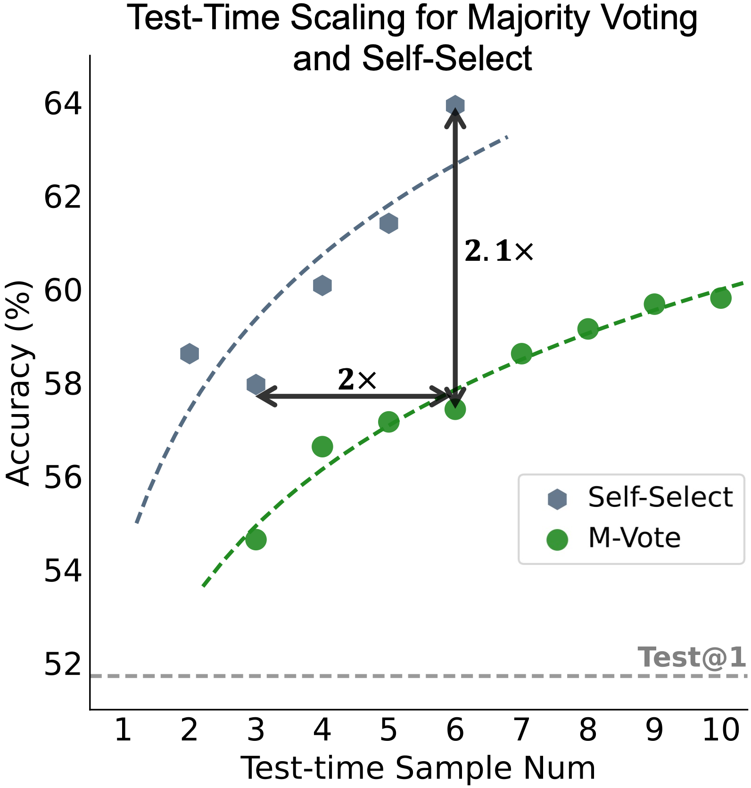

# MM-Self-Improve (Qwen2-VL)

> [!Note]
> Please use the code from the main branch, as updates may be made in the future.

## Introduction

This project contains the code for our paper *Vision-Language Models Can Self-Improve Reasoning via Reflection.* [[arxiv](https://arxiv.org/abs/2411.00855)] 

We introduce a new method called MM-Self-Improve to enhance the reasoning abilities of vision-language models. This approach focuses on guiding VLLMs to learn from reflections on rationales, thereby improving their reasoning performance. Additionally, we propose a self-select task that enables the model to choose the most likely correct answer from candidates generated by itself.

The latest open-sourced model, Qwen2-VL, benefits significantly from this method, showing improved results in multimodal reasoning tasks. Additionally, it offers greater efficiency during test-time self-selection compared to traditional majority voting methods.

The code is based on the 🤗 [Qwen2-VL-7B-Instruct](https://huggingface.co/Qwen/Qwen2-VL-7B-Instruct) and [LLaMA-Factory](https://github.com/hiyouga/LLaMA-Factory?tab=readme-ov-file) for fine-tuning model. 
You could find the train guide in [Qwen2-VL repository](https://github.com/QwenLM/Qwen2-VL?tab=readme-ov-file#training).
We wrote the inference code with `accelerate` supporting for multiple GPUs on single machine.


## News

- **[November 4, 2024]**: We provide running scripts for self-select scaling task.
- **[November 3, 2024]**: We release the code for MM-self-Improve (Qwen2-VL).

## Performance

### Self-training on GeoQA

The following results illustrate the effectiveness of our self-training framework and its scalability on the GeoQA dataset:

| Method                             | Score  |
|------------------------------------|--------|
| Zero-shot CoT                      | 17.11  |
| Self-Train R3V                    | 51.72  |
| + Test-Time Selection (N=3)       | 57.96  |

### Test-Time Selection Efficiency on GeoQA



The test-time selection method showcases superior scalability, with a performance boost to 70.23 through majority voting and self-selection sampling.


## Quickstart

Following we provide a example to show to to run the self-training and self-selection scaling code.

### Installation

Please download the Qwen2-VL checkpoint from [🤗Huggingface](https://huggingface.co/Qwen/Qwen2-VL-7B-Instruct) and put it anywhere you want. Our script only requires the checkpoint's absolute path.

Our code is dependent on the Qwen2-VL and LLaMA-Factory. To install the environment, we recommend following the install guides of [Qwen2-VL](https://github.com/QwenLM/Qwen2-VL?tab=readme-ov-file#quickstart) and [LLaMA-Factory](https://github.com/hiyouga/LLaMA-Factory?tab=readme-ov-file#installation).

If you don't want to read the guide, install the dependencies with the `requirements.txt` file in this repository.
```base
pip install -r requirements.txt
cd LLaMA-Factory
pip install -e ".[torch,metrics]"
```

### Data Preparation

Please download our processed GeoQA dataset from [here](https://box.nju.edu.cn/d/52900df37580459daaa0/), and extract it to `geoQA-data` folder.

### Self-Training

Use the following command to run the self-training code.
```bash
python run.py --base_model PATH_TO_Qwen2-VL-7B-Instruct --geoqa_dir PATH_TO_GeoQA_DATA --total_iters 3 --batch_size 4 
```
> [!TIP]
> Use `CUDA_VISIBLE_DEVICES=0,1` to control GPUs usage, our scripts will automatically use 4 GPUs.

`run.py` will automatically running our self-training iteration, and the results will be saved in the `outputs` folder. The iteration number is controlled by the `total_iters` argument, we set it to 3 in our experiment. The model's predictions will be saved in `outputs` folder, and the synthetic training data will be saved in `data/geoqa` folder.

For more details, please refer to the [Details](docs/details.md) file.

### Self-Selection Scaling

Self-selection scaling can start with following command.

```bash
python self_select_scaling.py --base_model PATH_TO_Qwen2-VL-7B-Instruct --geoqa_dir PATH_TO_geoQA-data --batch_size 8 --ckpt_dir LLaMA-Factory/saves/CKPT_PATH --max_select_num 6
```

`ckpt_dir` is the path to the checkpoint folder of the self-training process, and `max_select_num` is the number of selected samples in the self-selection process. For more details, please refer to the [Details](docs/details.md) file.

> [!NOTE]
> Please make sure it have sampled training data during self-training process. For example, if you use checkpoint for the 3-th iteration, the sampled training data should be in `outputs` for iteration 0 to 3.


## Citation

If you find our paper and code useful in your research, please consider giving a star ⭐ and citation 📝 :)

```bibtex
@misc{cheng2024visionlanguagemodelsselfimprovereasoning,
      title={Vision-Language Models Can Self-Improve Reasoning via Reflection}, 
      author={Kanzhi Cheng and Yantao Li and Fangzhi Xu and Jianbing Zhang and Hao Zhou and Yang Liu},
      year={2024},
      eprint={2411.00855},
      archivePrefix={arXiv},
      primaryClass={cs.LG},
      url={https://arxiv.org/abs/2411.00855}, 
}
```